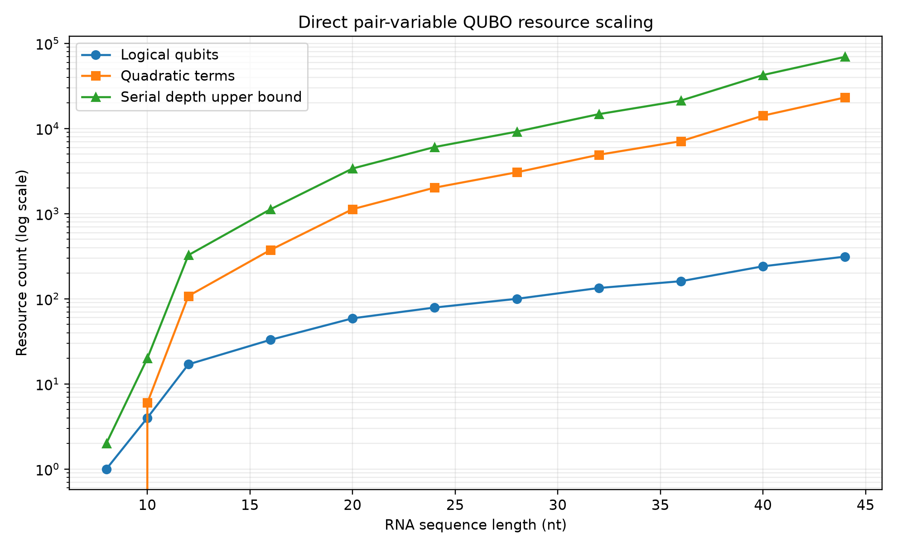

# Optimization of mRNA Secondary Structure Prediction Using Quantum Computing

[](https://github.com/nrk1029/Optimization-of-mRNA-Secondary-Structure-Prediction-Using-Quantum-Computing/actions/workflows/ci.yml)
[](https://github.com/nrk1029/Optimization-of-mRNA-Secondary-Structure-Prediction-Using-Quantum-Computing/releases)
[](https://www.python.org/)
[](LICENSE)

**WISER x Moderna Quantum Challenge 2026 submission**

This project investigates whether pseudoknot-free RNA secondary-structure
prediction can be expressed as a quadratic unconstrained binary optimization
(QUBO) problem and evaluated with exact optimization, QAOA, and noisy quantum
simulation.

The implementation uses ViennaRNA as the classical thermodynamic reference,
validates the QUBO on a reduced 9-qubit instance, and measures the resource
requirements of the 44-nucleotide challenge sequence.

> **Main conclusion:** the reduced QUBO works correctly, but biologically
> faithful full-sequence prediction requires a richer thermodynamic objective,
> compact encodings, and decomposition.

## Highlights

| Result | Value |
|---|---:|
| ViennaRNA MFE for the challenge sequence | `-7.90 kcal/mol` |
| Supplied candidate energy gap | `9.10 kcal/mol` |
| Reduced exact-QUBO structure | `(((...)))` |
| QAOA exact matches across depth/seed sweep | `7 / 9` |
| Noisy 9-qubit exact matches | `9 / 9` |
| Direct variables for the 44-nt sequence | `313` |
| Direct quadratic interactions | `23,187` |
| Stem-encoding variables | `200` |
| Full simplified-QUBO base-pair F1 | `0.50` |
| Full simplified-QUBO ViennaRNA energy gap | `21.7 kcal/mol` |

## Challenge sequence

```text
GGAGCAAAACUUGUCGAUUGAGAACAAAAUACAGAAUUUGCUUG
```

ViennaRNA reference:

```text
Structure: .(((((((..((((...(((....)))...))))..))))))).
MFE:       -7.90 kcal/mol
```

## Method


Each chemically permissible pair `(i, j)` is represented by a binary variable
`xᵢⱼ`. Selecting incompatible variables is discouraged with quadratic
penalties.

```text
H(x) = Σᵢ wᵢxᵢ + Σ(i,j) Pᵢⱼxᵢxⱼ
```

Simplified linear rewards:

- G-C / C-G: `-3`
- A-U / U-A: `-2`
- G-U / U-G: `-1`

A penalty of `+8` is applied when two selected pairs share a nucleotide or
cross to form a pseudoknot.

> The QUBO objective is an optimization score, not a thermodynamic energy.
> ViennaRNA energy is therefore evaluated and reported separately.

## Experimental findings

### Reduced-instance validation

For `GGGAAACCC`, the exact 9-variable QUBO reproduces the ViennaRNA MFE
structure:

```text
Sequence:   GGGAAACCC
Predicted:  (((...)))
Reference:  (((...)))
MFE gap:    0.00 kcal/mol
```

The QAOA robustness sweep tested depths `p=1`, `p=2`, and `p=3` with seeds
`7`, `21`, and `42`. Seven of nine runs matched the exact QUBO optimum.

### Full-sequence scaling



The direct 44-nt encoding requires 313 logical variables and 23,187 quadratic
terms. A dense statevector simulation is infeasible at this scale.

### Direct-pair versus stem encoding

Stem encoding reduces the full-sequence variable count from 313 to 200
(`36.1%` reduction) while retaining candidate coverage for every pair in the
ViennaRNA MFE structure.

### Noise experiment

The reduced instance was evaluated with 2,048 shots under ideal, low-noise, and
high-noise depolarizing models. All nine tested runs recovered the exact QUBO
solution. This demonstrates robustness only for the reduced instance and does
not establish large-instance noise tolerance.

## Installation

Python 3.12 is recommended.

```powershell
python -m venv .venv
.\.venv\Scripts\Activate.ps1
python -m pip install --upgrade pip
python -m pip install -r requirements.txt
```

Core dependencies:

- ViennaRNA
- Qiskit
- Qiskit Optimization
- Qiskit Aer
- NumPy
- Matplotlib

## Run the project

Run the tests:

```powershell
python -m unittest discover -s tests -v
```

Generate the ViennaRNA benchmark:

```powershell
python -m src.classical.vienna_benchmark `
  --input data/sequences.csv `
  --output results/vienna_benchmarks.csv
```

Run the experiments:

```powershell
python step10_qaoa_sweep.py
python advanced_encoding_comparison.py
python advanced_noisy_qaoa.py
python step08_generate_plots.py
```

QAOA and noisy simulations may take several minutes.

## Repository structure

```text
.
├── data/                         Input RNA sequences
├── docs/                         Documentation and presentation
├── results/                      Generated CSV results and figures
├── src/
│   ├── classical/                ViennaRNA benchmark
│   ├── evaluation/               Structure-quality metrics
│   └── rna_utils.py              RNA and dot-bracket utilities
├── tests/                        Unit tests
├── advanced_encoding_comparison.py
├── advanced_noisy_qaoa.py
├── step08_generate_plots.py
├── step10_qaoa_sweep.py
├── REPORT.md
└── requirements.txt
```

## Documentation

- [Full technical report](REPORT.md)
- [Step-by-step documentation with code](docs/Moderna_Stepwise_Documentation.docx)
- [Viva-ready PowerPoint presentation](docs/Moderna_Quantum_RNA_Presentation.pptx)
- [Consolidated experiment summary](results/experiment_summary.csv)

## Limitations

- The QUBO does not implement the complete nearest-neighbor thermodynamic
  model.
- Stacking, hairpin, bulge, internal-loop, and multiloop energies are not
  explicitly encoded.
- Pseudoknots are excluded.
- Direct pair encoding grows rapidly with sequence length.
- QAOA outcomes depend on circuit depth, initialization, sampling, and the
  classical optimizer.
- The 313-qubit full instance cannot be simulated with a dense statevector on
  ordinary hardware.

## Future work

1. Add stacking and loop-context energy terms.
2. Prune candidate pairs using classical probabilities.
3. Improve stem and hierarchical encodings.
4. Evaluate warm-start and recursive QAOA.
5. Decompose long RNA sequences into smaller optimization subproblems.
6. Test hardware-inspired noise models and real quantum backends.

## Author

**NELLORE RAVI KUMAR**

WISER x Moderna Quantum Challenge 2026

## License

This repository is distributed under the [Apache License 2.0](LICENSE).
