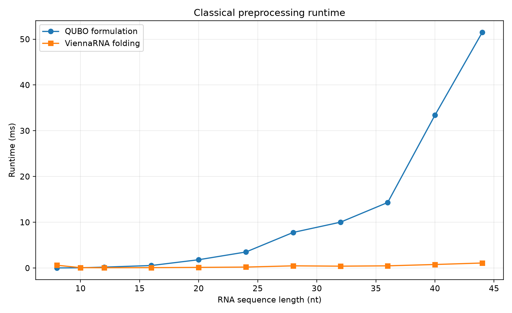

# Quantum-Assisted RNA Secondary Structure Prediction

## WISER x Moderna Quantum Challenge 2026

**Prepared by:** NELLORE RAVI KUMAR

## 1. Executive summary

This project investigates RNA secondary-structure prediction as a constrained
quadratic unconstrained binary optimization (QUBO) problem. ViennaRNA is used
as the classical thermodynamic reference. A direct pair-variable encoding is
validated on a 9-nucleotide RNA sequence using both an exact QUBO solver and a
QAOA statevector simulation. Resource scaling is then measured up to the
44-nucleotide sequence supplied in the challenge document.

The exact reduced QUBO reproduced the ViennaRNA MFE structure. A depth-one QAOA
run returned a valid but suboptimal structure, illustrating both the potential
and current limitations of shallow variational quantum optimization. For the
44-nucleotide sequence, the direct encoding requires 313 logical qubits and
23,187 quadratic interaction terms, making full statevector simulation
infeasible.

## 2. Biological and computational background

RNA secondary structure describes intramolecular base pairing that produces
stems, hairpins, bulges, and loops. Structure can affect mRNA stability,
translation efficiency, and manufacturability. Classical MFE folding searches
for the structure with the lowest predicted thermodynamic free energy.

The initial model permits canonical Watson-Crick pairs A-U and G-C, plus G-U
wobble pairs. Pseudoknots are excluded, and a minimum hairpin loop size of three
unpaired nucleotides is enforced.

## 3. Classical ViennaRNA benchmark

Challenge sequence:

```text
GGAGCAAAACUUGUCGAUUGAGAACAAAAUACAGAAUUUGCUUG
```

ViennaRNA reference:

```text
MFE structure: .(((((((..((((...(((....)))...))))..))))))).
MFE energy:    -7.90 kcal/mol
```

The structure supplied as an evaluation example in the challenge document has
energy +1.20 kcal/mol, producing an energy gap of 9.10 kcal/mol from the MFE.

## 4. QUBO formulation

Each chemically permissible candidate pair `(i, j)` is assigned a binary
variable `x_i_j`. A value of one means that the pair is selected.

The simplified objective is:

```text
H(x) = sum_i w_i x_i + sum_(i,j) P_ij x_i x_j
```

Linear rewards are -3 for G-C/C-G, -2 for A-U/U-A, and -1 for G-U/U-G.
Quadratic penalties of +8 are applied when two variables share a nucleotide or
form crossing pairs. The weights are simplified optimization scores and must
not be interpreted as ViennaRNA thermodynamic energies.

## 5. Reduced-instance validation

Reduced sequence:

```text
GGGAAACCC
```

| Method | Predicted structure | QUBO objective | ViennaRNA energy | MFE gap |
|---|---:|---:|---:|---:|
| Exact QUBO | `(((...)))` | -9.0 | -1.20 kcal/mol | 0.00 |
| QAOA, p=1, seed 42 | `.((...).)` | -6.0 | 5.90 kcal/mol | 7.10 |

The exact QUBO reproduced the ViennaRNA MFE structure. The shallow QAOA result
was feasible but suboptimal, with an objective gap of 3.0.

### 5.2 Full 44-nucleotide classical QUBO baseline

The 313-variable QUBO was optimized with ten seeded simulated-annealing
restarts. The best result selected 14 nonconflicting base pairs and had a
simplified QUBO objective of -31.0.

```text
Predicted: .(((((.((.((((.(..(....))(...)))..))))))))).
Reference: .(((((((..((((...(((....)))...))))..))))))).
```

| Metric | Result |
|---|---:|
| Remaining structural conflicts | 0 |
| Predicted ViennaRNA energy | 13.8 kcal/mol |
| Reference MFE energy | -7.9 kcal/mol |
| Energy gap | 21.7 kcal/mol |
| Base-pair precision | 0.50 |
| Base-pair recall | 0.50 |
| Base-pair F1 | 0.50 |

The structure is combinatorially valid under the encoded constraints, but its
thermodynamic quality is poor. This is direct evidence that simple per-pair
rewards are insufficient for realistic mRNA folding: stacking, loop, bulge,
and multiloop context must be represented in the objective. It also shows why
QUBO objective quality and ViennaRNA energy must be reported separately.

### 5.1 QAOA depth and seed sweep

A nine-run robustness experiment compared depths p=1, p=2, and p=3 using
seeds 7, 21, and 42. Each run used a seed-specific initial point.

| QAOA depth | Exact matches | Success rate | Mean runtime |
|---|---:|---:|---:|
| p=1 | 3/3 | 100.0% | 1.12 s |
| p=2 | 2/3 | 66.7% | 1.62 s |
| p=3 | 2/3 | 66.7% | 2.57 s |

Overall, seven of nine runs matched the exact QUBO optimum. The fastest exact
match was p=1 with seed 21 at 0.871 seconds. Increasing circuit depth did not
monotonically improve solution quality and increased runtime. This demonstrates
sensitivity to initialization and classical parameter optimization: greater
ansatz depth alone is not a guarantee of a better variational solution.

## 6. Scaling analysis

For the supplied 44-nucleotide RNA sequence, the direct encoding produced:

- 313 binary variables and estimated logical qubits
- 4,933 shared-nucleotide conflicts
- 18,254 crossing-pair conflicts
- 23,187 quadratic QUBO terms
- 46,374 estimated logical two-qubit gates at QAOA depth p=1
- a conservative serial logical depth upper bound of 69,563
- an estimated statevector memory requirement of approximately 2^287 GB

The statevector memory requirement grows exponentially with qubit count. The
reported circuit depth is a conservative serial logical upper bound; actual
transpiled depth depends on parallel scheduling, hardware connectivity, routing,
and the native gate set.




## 7. Limitations

- Pair weights do not implement the complete nearest-neighbor thermodynamic
  model used by ViennaRNA.
- Loop, stacking, bulge, and multiloop energies are not explicitly encoded.
- Pseudoknots are excluded.
- The direct pair encoding grows approximately quadratically in sequence length.
- QAOA quality depends on circuit depth, initial parameters, sampling, and the
  classical optimizer.
- Full-instance QAOA simulation is infeasible with a dense 313-qubit
  statevector.

## 8. Advanced encoding comparison

The direct pair-variable encoding was compared with a contiguous stem encoding
that represents stacks of at least two nested base pairs as single variables.

| Sequence length | Direct variables | Stem variables | Reduction | MFE-pair candidate coverage |
|---:|---:|---:|---:|---:|
| 9 | 9 | 5 | 44.4% | 100% |
| 12 | 17 | 9 | 47.1% | 100% |
| 16 | 33 | 18 | 45.5% | 100% |
| 20 | 59 | 33 | 44.1% | 100% |
| 28 | 100 | 59 | 41.0% | 100% |
| 36 | 161 | 82 | 49.1% | 100% |
| 44 | 313 | 200 | 36.1% | 100% |

For the full challenge sequence, stem encoding reduced the nominal logical-qubit
requirement from 313 to 200 while retaining every ViennaRNA MFE pair within at
least one candidate stem. This coverage measure does not by itself prove that
the full thermodynamic optimum will be recovered by the simplified stem QUBO;
the stem objective and compatibility constraints must still be optimized.

Direct encoding is more flexible and naturally represents isolated pairs, but
requires more qubits and conflict terms. Stem encoding is more compact and
captures stacking structure directly, but can exclude isolated pairs and creates
overlapping variable choices that require careful constraint design.

## 9. Noise robustness experiment

The 9-qubit reduced instance was evaluated with 2,048 shots per run under an
ideal Aer simulation and two custom depolarizing-noise conditions. Three seeds
were tested per condition.

| Condition | 1-qubit error | 2-qubit error | Exact matches | Mean runtime |
|---|---:|---:|---:|---:|
| Ideal | 0% | 0% | 3/3 | 2.46 s |
| Low noise | 0.1% | 1% | 3/3 | 8.80 s |
| High noise | 0.5% | 3% | 3/3 | 7.85 s |

All nine runs recovered the exact QUBO solution `(((...)))` with zero QUBO and
ViennaRNA energy gaps. For this small, strongly penalized instance, the tested
noise levels did not change the selected optimum. Noisy simulation was roughly
three to four times slower than ideal simulation. These results demonstrate
robustness only for this reduced instance and shot budget; they do not establish
noise tolerance for larger or more weakly separated RNA QUBOs.

## 10. Future work

- Prune candidate pairs using classical probabilities or domain constraints.
- Add stacking and loop-context terms to improve biological fidelity.
- Compare QAOA depths, seeds, optimizers, and warm-start strategies.
- Evaluate noise sensitivity using hardware-inspired simulator models.
- Compare direct pair, stem-based, and hierarchical encodings.
- Investigate recursive or decomposition-based QAOA for larger sequences.

## 11. Reproducibility

Create and activate a Python virtual environment, then install:

```powershell
python -m pip install ViennaRNA qiskit qiskit-optimization matplotlib
```

Core generated artifacts are stored in `results/`, while scaling measurements
are stored in `scaling_results.csv`.
